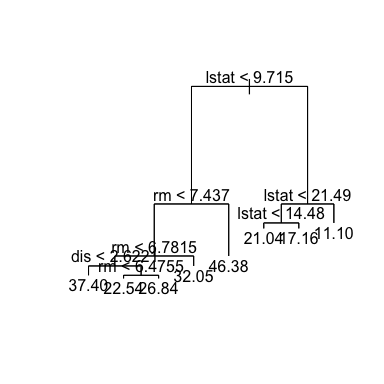
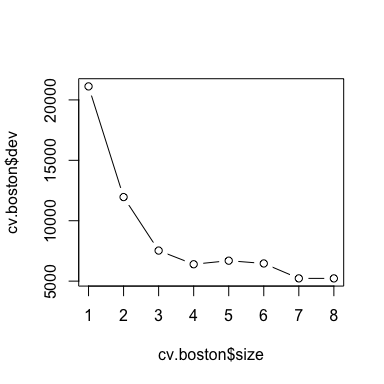
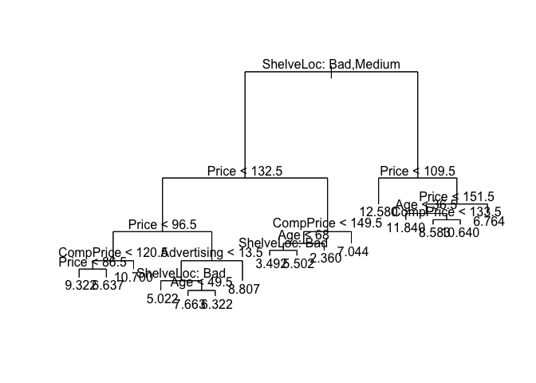
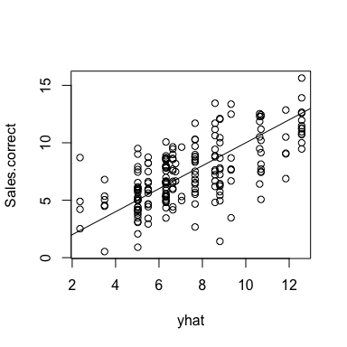
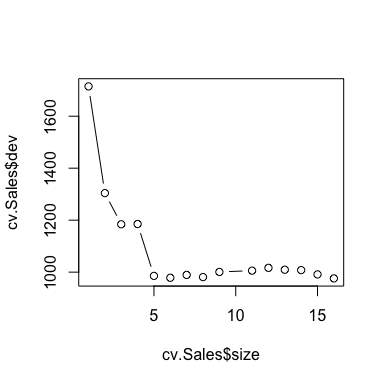
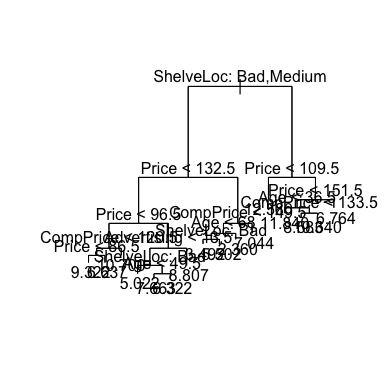
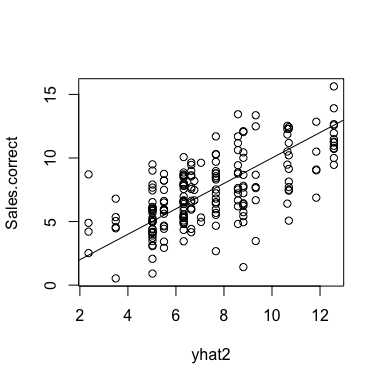

# Decision trees for regression problems
James Gammerman  
26 April 2017  

# Predicting house prices in Boston, USA
 


* The Boston dataset (part of the standard R distribution) describes housing values and other information about Boston suburbs - 506 neighbourhoods in total. In particular, it records median house value *(medv)* for each neighbourhood 

* Let's try to predict median house value using 13 attributes such as average number of rooms per house *(rm)*, average age of houses *(age)*, and percent of households with low socioeconomic status *(lstat)*.

***
# Fitting the model
* First we create the training set and fit the tree to the training data:

```r
set.seed(1)
train <- sample(1:nrow(Boston), nrow(Boston)/2)
tree.boston <- tree(medv ~ ., Boston, subset = train)
summary(tree.boston)
```

```
## 
## Regression tree:
## tree(formula = medv ~ ., data = Boston, subset = train)
## Variables actually used in tree construction:
## [1] "lstat" "rm"    "dis"  
## Number of terminal nodes:  8 
## Residual mean deviance:  12.65 = 3099 / 245 
## Distribution of residuals:
##      Min.   1st Qu.    Median      Mean   3rd Qu.      Max. 
## -14.10000  -2.04200  -0.05357   0.00000   1.96000  12.60000
```

* Notice that the output of summary() indicates that only three of the variables have been used in constructing the tree.
* In the context of a regression tree, the deviance is simply the sum of squared errors for the tree (see lec slide 46). We now plot the tree.

***
# The resulting decision tree 

```r
plot(tree.boston)
text(tree.boston, pretty = 0)
```

<!-- -->

* The tree indicates that lower values of lstat correspond to more expensive houses. The tree predicts a median house price of $46,380 for larger homes in suburbs in which residents have high socioeconomic status (rm>=7.437 and lstat<9.715).

***
# Could cost complexity pruning improve our prediction?
* Now we use the cv.tree() function to see whether pruning the tree will improve performance.

```r
cv.boston <- cv.tree(tree.boston)
plot(cv.boston$size, cv.boston$dev, type = 'b')
```

<!-- -->

* In this case, the most complex tree is selected by cross-validation. 


***
# Predictions
* Therefore we use the unpruned tree to make predictions on the test set:

```r
yhat <- predict(tree.boston, newdata = Boston [-train,])   # predictions for Boston medv
boston.test  = Boston[-train, "medv"]  # correct results for Boston medv
plot(yhat, boston.test)
abline(0,1)  # The function abline(a,b) draws a line with intercept a and slope b
```

<!-- -->

```r
mean((yhat - boston.test)^2)  
```

```
## [1] 25.04559
```
* This is the test set MSE, and we get a value of 25.05. The sqrt is 5.005, indicating that this model leads to test predictions that are within around $5,005 of the true median home value for the suburb!

***
# Problem 2 - predicting sales using regression trees 

* First we split the Carseats data set (400 observations) into a training set of size 200 and a test set of the same size:


```r
data(Carseats)
attach(Carseats)
set.seed(3)
training.set <- sample(1:nrow(Carseats), nrow(Carseats)/2)  # creates "training set" (actually just a vector of random numbers)
test.set <- Carseats[-training.set,] # creates test set
Sales.test <- Sales[-training.set]  # the "correct" values for Sales in our test set that we will test our predictions against
```

***
* First we fit, summarise and plot the regression tree:

```r
tree.Sales <- tree(Sales ~., Carseats, subset = training.set)   # fits the regression tree
summary(tree.Sales)
```

```
## 
## Regression tree:
## tree(formula = Sales ~ ., data = Carseats, subset = training.set)
## Variables actually used in tree construction:
## [1] "ShelveLoc"   "Price"       "CompPrice"   "Advertising" "Age"        
## Number of terminal nodes:  16 
## Residual mean deviance:  2.277 = 418.9 / 184 
## Distribution of residuals:
##     Min.  1st Qu.   Median     Mean  3rd Qu.     Max. 
## -3.68700 -0.94690  0.08223  0.00000  0.97400  4.59800
```

```r
plot(tree.Sales)
text(tree.Sales, pretty = 0)
```

<!-- -->

* **Interpretation: most important factor is shelf location (bad or medium) followed by price**

***  
* Now let's use our tree to make some predictions on the test set.


```r
yhat <- predict(tree.Sales, newdata = Carseats[-training.set,])   # get predictions on the test set using our tree
Sales.correct  = Carseats[-training.set, "Sales"]  # correct results for Boston medv
plot(yhat, Sales.correct)  # plot prediction for unit sales vs correct value
abline(0,1)  # The function abline(a,b) draws a line with intercept a and slope b
```

<!-- -->

***
Now let's calculate the mean squared error:

```r
mean((yhat - Sales.correct)^2) 
```

```
## [1] 4.707596
```

* Test set MSE = 4.71, so this model leads to predictions that are within around (sqrt(4.71)) x 1000 = 2170 of the correct number of unit Sales at each location

# Cross complexity pruning

* Let's again use cross-validation in order to determine the optimal level of tree complexity. Does pruning the tree improve the test MSE?

* First we use cross validation (using the cv.tree() function) to generate a plot of dev (corresponding to error rate) vs size of tree:


```r
cv.Sales <- cv.tree(tree.Sales)
cv.Sales
```

```
## $size
##  [1] 16 15 14 13 12 11  9  8  7  6  5  4  3  2  1
## 
## $dev
##  [1]  975.9487  991.3199 1007.9074 1009.3476 1016.5956 1005.7502 1000.7542
##  [8]  981.1084  989.4081  978.4336  985.6305 1185.2604 1184.1556 1304.1405
## [15] 1714.6873
## 
## $k
##  [1]      -Inf  19.25074  21.47137  22.40988  25.82672  28.57120  34.33121
##  [8]  38.68928  40.05112  48.23203  82.09826 107.14711 119.49475 220.52606
## [15] 436.41673
## 
## $method
## [1] "deviance"
## 
## attr(,"class")
## [1] "prune"         "tree.sequence"
```

```r
plot(cv.Sales$size, cv.Sales$dev, type = 'b')
```

<!-- -->

* Cross-validation suggests that the optimal level of tree complexity is 16 nodes, with k (placeholder for alpha tuning parameter) = - infinity. Now we prune the tree accordingly.
 

```r
prune.Sales <- prune.tree(tree.Sales, best=16)
plot(prune.Sales)
text(prune.Sales, pretty=0)
```

<!-- -->

```r
yhat2 <- predict(prune.Sales, newdata = Carseats[-training.set,])
plot(yhat2, Sales.correct)  
abline(0,1) 
```

<!-- -->

```r
mean((yhat2 - Sales.correct)^2) 
```

```
## [1] 4.707596
```

* The test MSE is 4.71 again i.e. pruning the tree did not improve the test MSE

     

